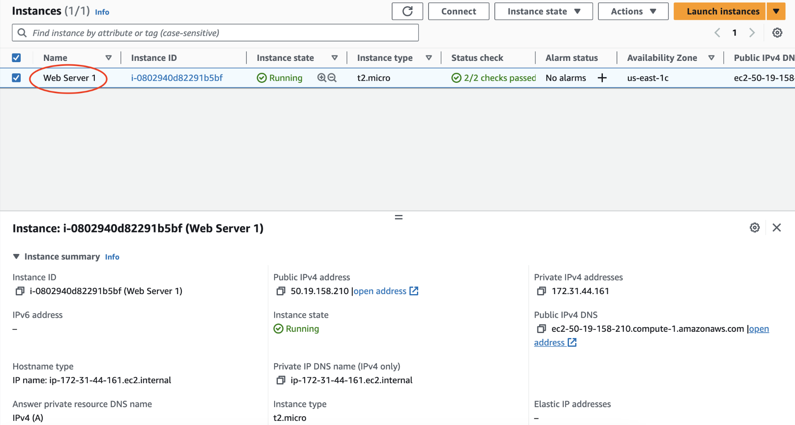
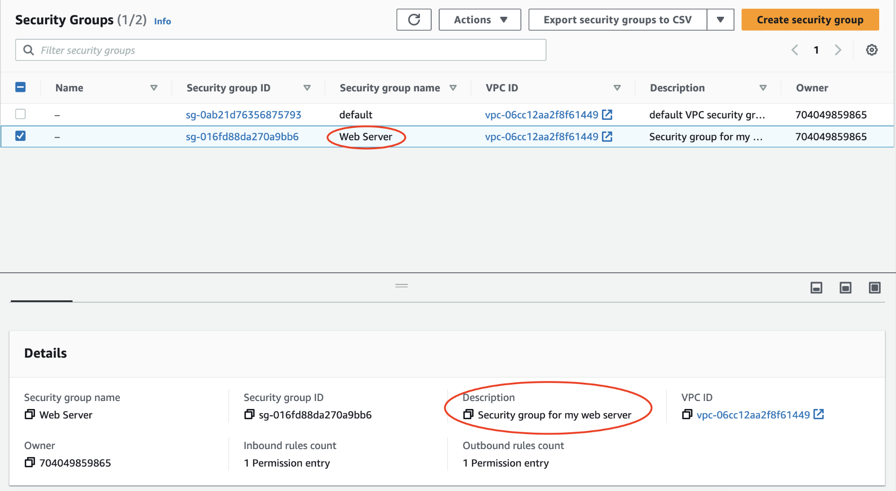
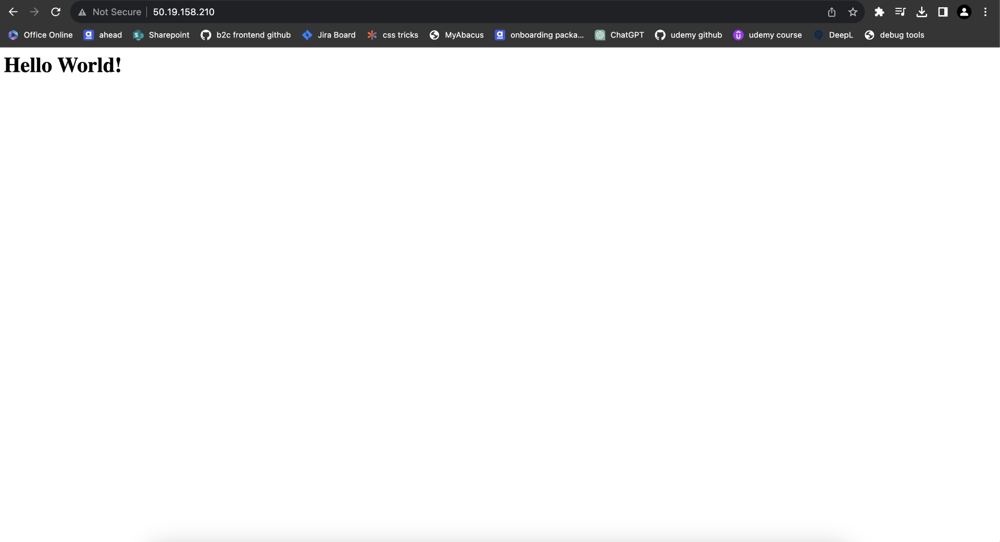
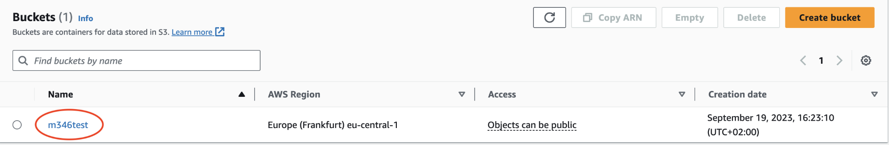
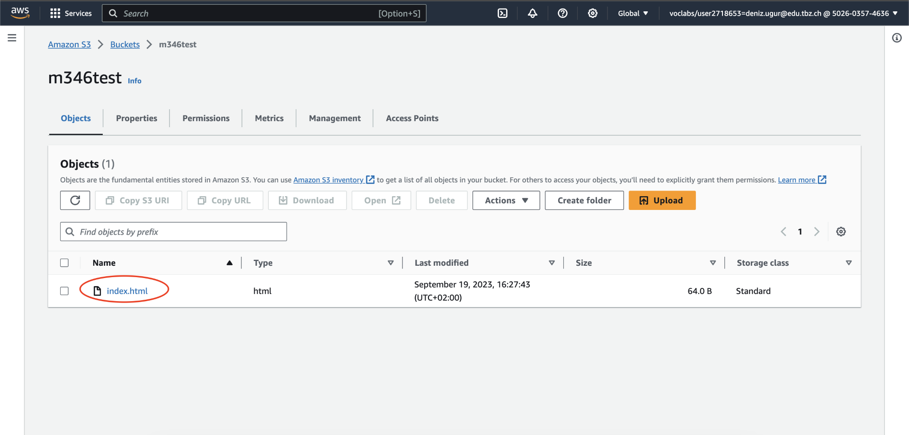
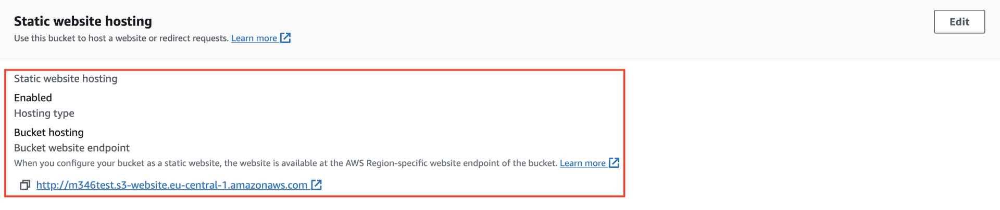
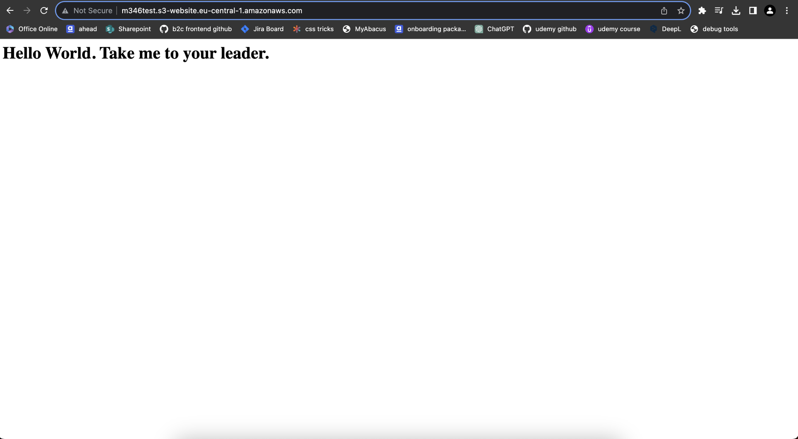

## 4.1
### Details der Web Server-Instanz

### Security group

### Endresultat 💥

## 4.2
### Buckets

### Datei im Bucket

###  Eigenschaften von "Static website hosting".

### Endresultat 💥

