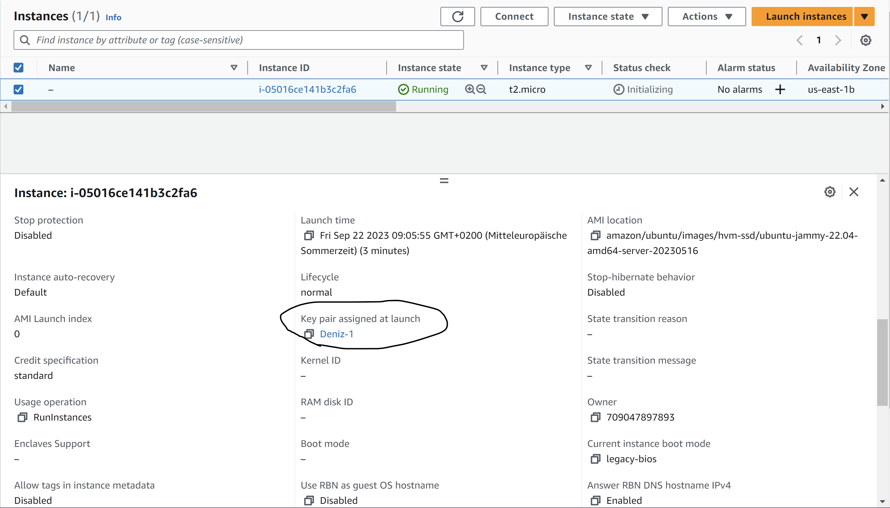

#### Hier ist der SSH-Key, den ich der Instance zugewiesen habe

#### Ich habe probiert, mit dem andern SSH-Key den ich erstellt habe, eine verbindung zu der Instance aufzubauen, aber ich habe einen Error bekommen, da ich mit dem 1. Keypair arbeite muss.

#### Und siehe, mit dem 1. Keypair hat es funktioniert
