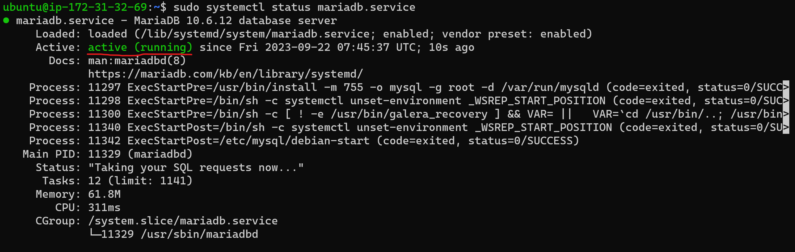
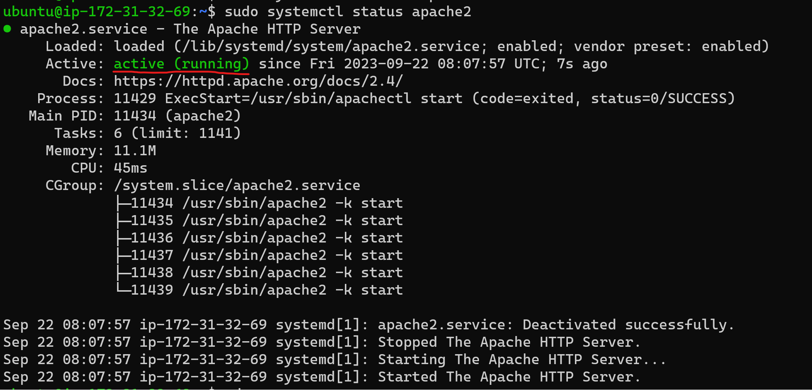
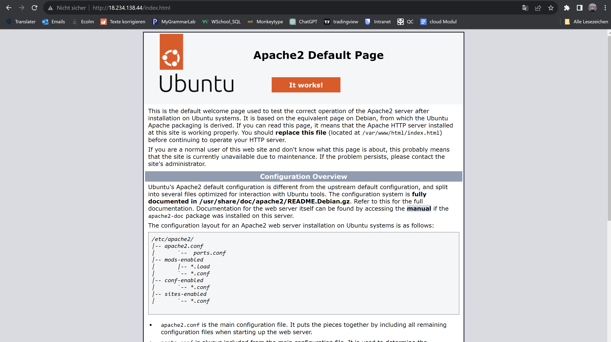
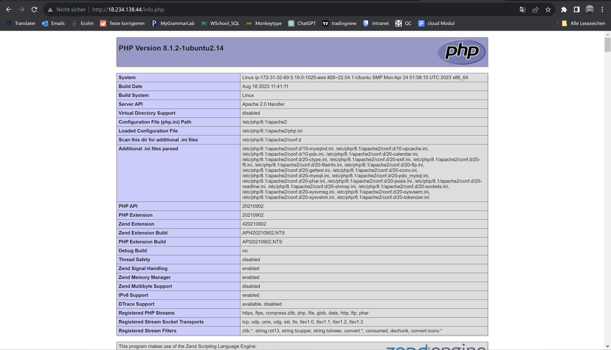
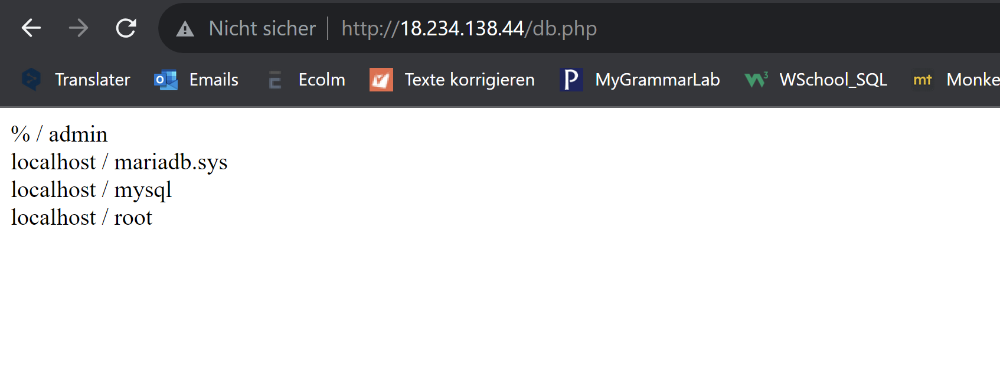

#### mariadb funktioniert!!!

#### apache2 funktioniert auch!!!

### Endresultat 💥
#### index.html

#### info.php

#### db.php

### Quelle
- [gitlab](https://gitlab.com/ser-cal/m346/-/blob/main/KN04/KN04.md)