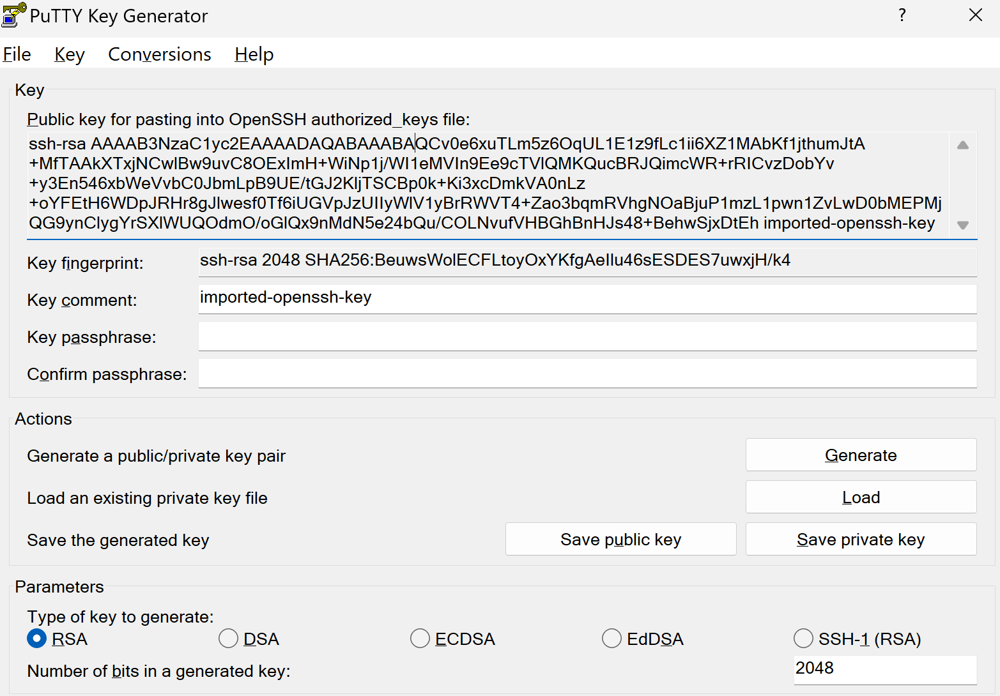
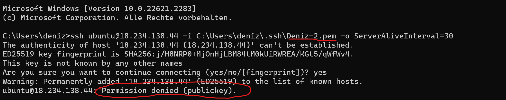
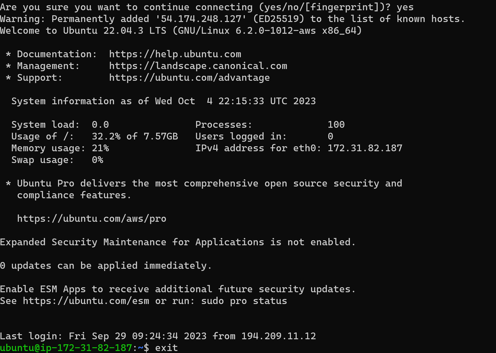
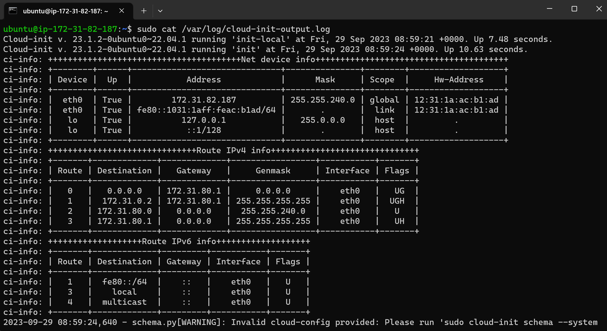

#### Public Key generiert
Zuerst habe ich mithilfe von puTTY Key Generator einen public key generiert.


#### angepasste yaml file
Dann habe ich den generierten public Key in die YAML file eingefügt
``` yaml
#cloud-config
users:
  - name: ubuntu
    sudo: ALL=(ALL) NOPASSWD:ALL
    groups: users, admin
    home: /home/ubuntu
    shell: /bin/bash
    ssh_authorized_keys:
      - ssh-rsa AAAAB3NzaC1yc2EAAAADAQABAAABAQCv0e6xuTLm5z6OqUL1E1z9fLc1ii6XZ1MAbKf1jthumJtA+MfTAAkXTxjNCwlBw9uvC8OExImH+WiNp1j/WI1eMVIn9Ee9cTVlQMKQucBRJQimcWR+rRICvzDobYv+y3En546xbWeVvbC0JbmLpB9UE/tGJ2KljTSCBp0k+Ki3xcDmkVA0nLz+oYFEtH6WDpJRHr8gJlwesf0Tf6iUGVpJzUIIyWlV1yBrRWVT4+Zao3bqmRVhgNOaBjuP1mzL1pwn1ZvLwD0bMEPMjQG9ynClygYrSXlWUQOdmO/oGlQx9nMdN5e24bQu/COLNvufVHBGhBnHJs48+BehwSjxDtEh imported-openssh-key
ssh_pwauth: false
disable_root: false 
package_update: true
packages:
  - curl 
  - wget 
```

#### Mit dem falschen key probiert


#### Mit dem richtigen key probiert und alles funktioniert! 🤯


### Erklärung warum nur ein key funktioniert
Es funktioniert nur 1 key, da ich in der Insanz nur den einen Key defniniert habe und man auch nur mit dem Private key von diesem Key sich verbinden kann.
#### Hier ist der output von der log file
