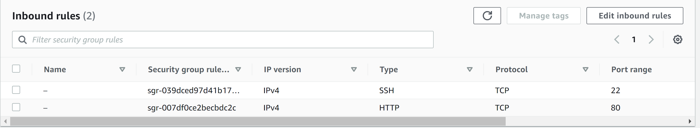

## Auftrag C
### Zuerst habe ich den public key von herr Calisto in meinen code implementiert
``` yaml
#cloud-config
users:
  - name: ubuntu
    sudo: ALL=(ALL) NOPASSWD:ALL
    groups: users, admin
    home: /home/ubuntu
    shell: /bin/bash
    ssh_authorized_keys:
      - ssh-rsa AAAAB3NzaC1yc2EAAAADAQABAAABAQCv0e6xuTLm5z6OqUL1E1z9fLc1ii6XZ1MAbKf1jthumJtA+MfTAAkXTxjNCwlBw9uvC8OExImH+WiNp1j/WI1eMVIn9Ee9cTVlQMKQucBRJQimcWR+rRICvzDobYv+y3En546xbWeVvbC0JbmLpB9UE/tGJ2KljTSCBp0k+Ki3xcDmkVA0nLz+oYFEtH6WDpJRHr8gJlwesf0Tf6iUGVpJzUIIyWlV1yBrRWVT4+Zao3bqmRVhgNOaBjuP1mzL1pwn1ZvLwD0bMEPMjQG9ynClygYrSXlWUQOdmO/oGlQx9nMdN5e24bQu/COLNvufVHBGhBnHJs48+BehwSjxDtEh imported-openssh-key
      # public key von herr calisto
      - ssh-rsa AAAAB3NzaC1yc2EAAAADAQABAAACAQCz/wpWmsCxaQyuNFrIachc/q9nUdByoUcBcicl/wnKLFktKp6du9np9Uhmo4M0tVHNnWCt5uNEi2ks/0XEbg2J+4heuAAKEDr/TVbgabiWGclYKpEWZvmw8gsQwfpAKVG4aS2re7wB2uhw82ZqzJVpGm3ne+sNnz5uVrxN8HUnuR2OWJD6bA9l/fBmE6zdObVXgrCJGjZmVyB5GMeTDJKExgoBpLggZn9CNdu7Sx989xtNLehu6SWM+mGCq9Lcu7usiPG+SuEb8XynYaCOnv8+Oko6SYeJ9Omq/E7Eg6vZHqCbBQ81TIZrGKcikLmF2xP7EOprGOSPVewke7ak7vvmOI+p/RfIAyXj1+GYny+esk9G+qDRFXP9uiIlMfH1oGkQkztvSDMH+EOHqgY66NWQJPj83CaWH/euR0MROHXjm1ar3RuN9qcASAnzCOQQ1FMwFkpIV5x0NDRx0Zp1rLt8ZUFykmIuHZI4g9u6RdAiuWUxx9/eF0fXZa6Ju7GEMKeMtZxJJjmB/WCOylbkT+NPw5RcxgyRLKmUAicnYKXBmULY3pQM/Ui8KiCyJqRbLDBAR+XZYsZ7X5uhcuteu8KIfA2xEbInB4Q3c0DnnSih+GEC4pEbz+NOfeCpLJEn4gfyV1S9S08sG62ls8NPFociA9aWmE1oXfcqwvOkkYhxOw==
ssh_pwauth: false
disable_root: false
package_update: true
packages:
  - curl
  - wget
```

### Dann habe ich denn public key von ihm in meiner instance hinzugefügt:


Ich musste noch bei der inbound rule eine regel hinzufügen, dass man mit ssh darauf zugreifen kann.
