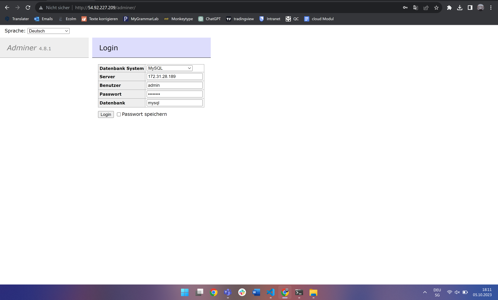

### Auftrag D

#### Die Verbindung zu der Datenbank Instanz funktioniert 

#### Die Verbindung zu der Web Server Instanz hat auch funktioniert

#### Apache2 server neu starten

#### Nun konnte ich mich zu der Datenbank verbinden

#### In die Datenbank einloggen

### Über das GUI konnte ich mich auch verbinden

#### Index.html

#### info.php

#### db.php 

#### Connected with telnet (telnet 35.175.210.89 3306)

### Quelle
- [gitlab](https://gitlab.com/ser-cal/m346/-/blob/main/KN04/KN04.md)
- Marwin Kohl
- Abinayan Sureskumar