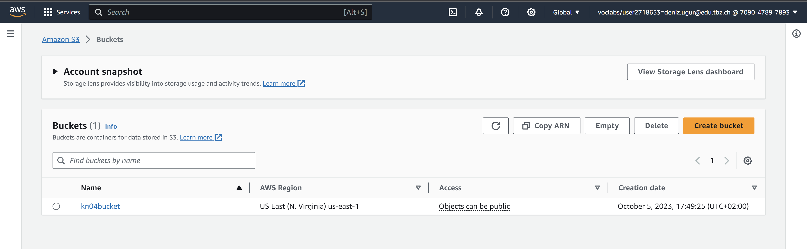
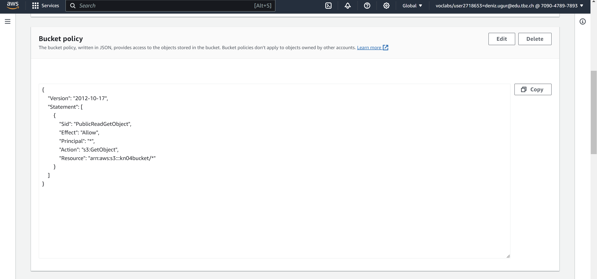
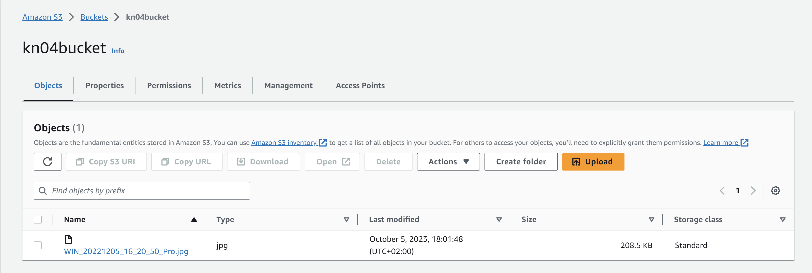

### Auftrag A (S3 Bucket erstellen)

#### Hier ist der Bucket den ich erstellt habe:

#### Das ist die Bucker Policy die ich erstellt habe:

#### Dann habe ich ein Bild in den S3 Bucket hinzugefügt

### Quelle
- [gitlab](https://gitlab.com/ser-cal/m346/-/blob/main/KN04/KN04.md)