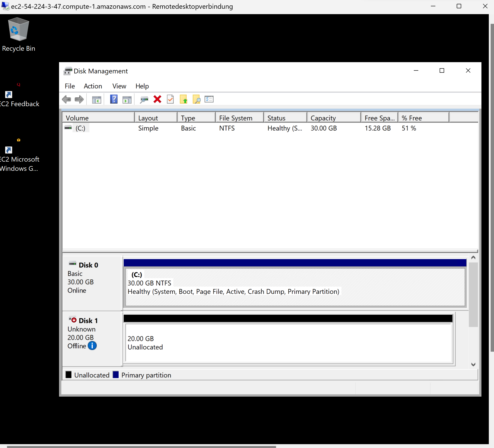
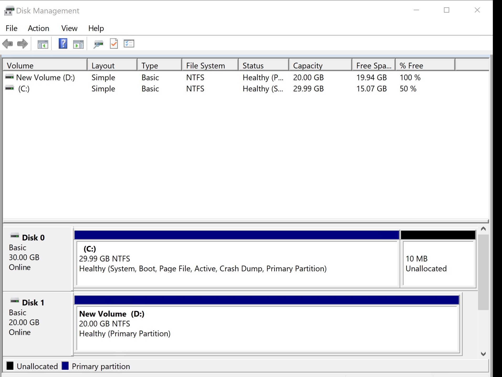
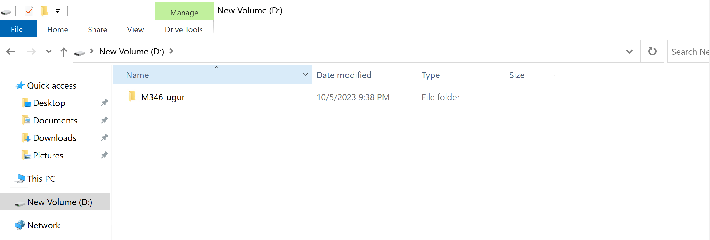

### Auftrag C

**password:** NxkZukRG*--l$XO5?t.CQH26s67&j?Id

**public dns:** ec2-54-224-3-47.compute-1.amazonaws.com

**admin:** Administrator

#### Zuerst habe ich eine Insanz erstellt

#### Hier konnte ich mich via Remotedesktopverbindung zu der Instanz verbinden

#### Hier habe ich ein neues Volume erstellt

#### Schlussendlich habe ich in diesem Volume einen Ordner erstellt 💥

### Quelle
- [gitlab](https://gitlab.com/ser-cal/m346/-/blob/main/KN04/KN04.md)