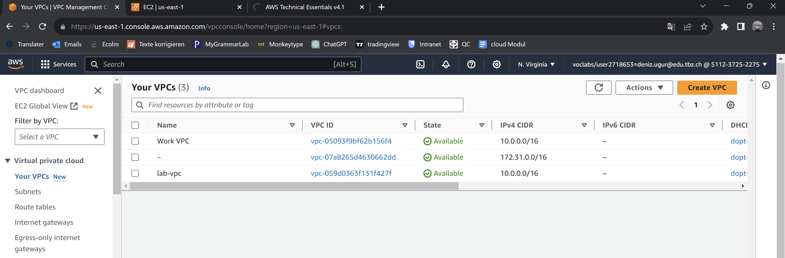
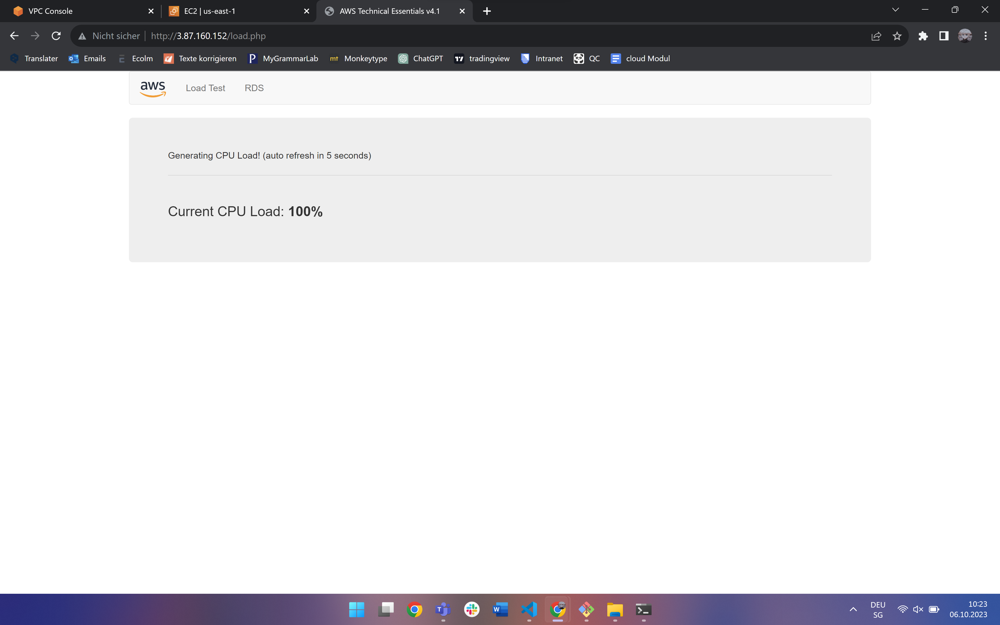

### VPC erstellen und einen Web Server darin deployen

#### Meine Instanz (private ip fängt mit 10.0.2.99)

#### Lab VPC erstellt

#### Subnets erstellt

#### Ergebnis 💥

#### Load test getriggert
