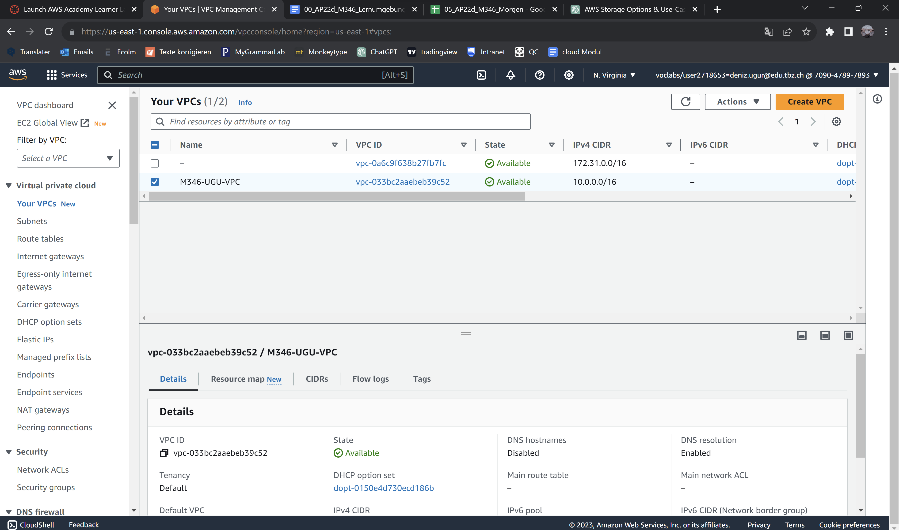
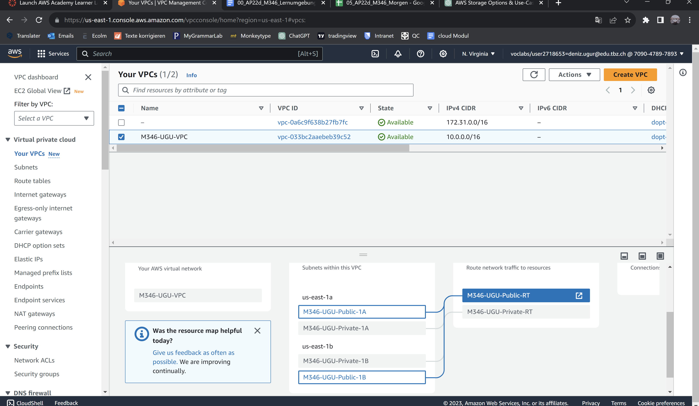
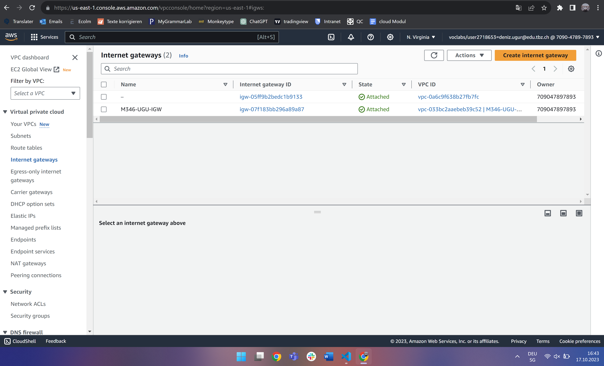
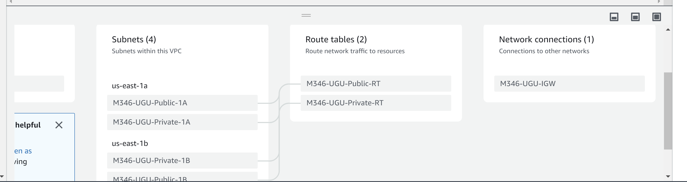
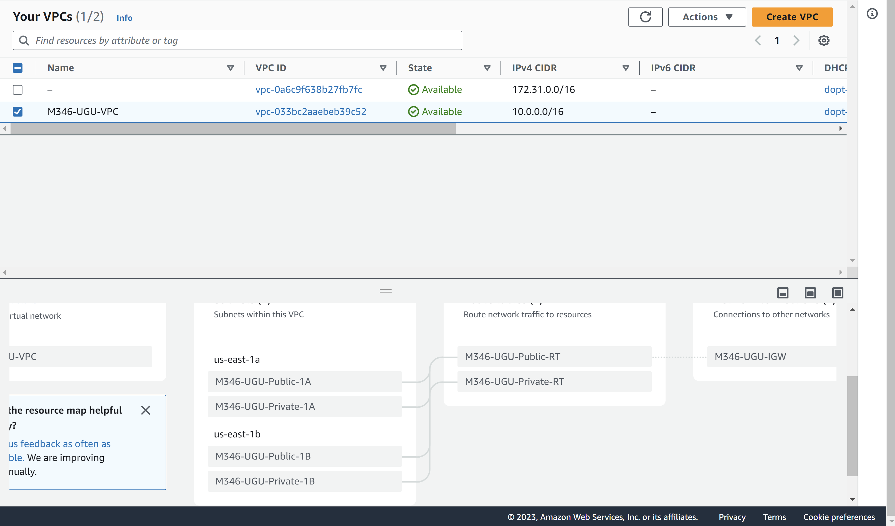
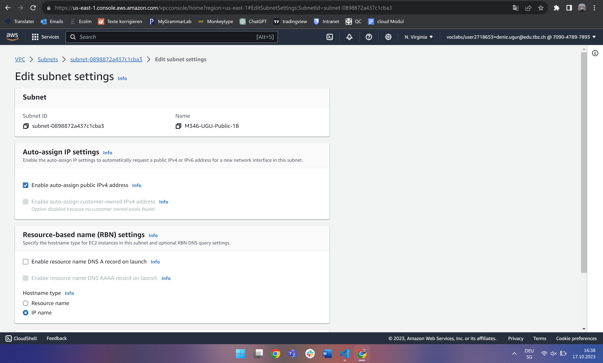

### Eigene VPC mit je zwei Public- und Private Subnets in zwei verschiedenen Availability Zones erstellen

### Konfigurations file
#### Create VPC
Name: M346-UGU-VPC
IPv4 CIDR Block: 10.0.0.0/16

#### Create Public Subnets
Name: M346-UGU-Public-1A
Availability Zone: us-east-1a
IPv4 CIDR Block: 10.0.1.0/24
 
Name: M346-UGU-Public-1B
Availability Zone: us-east-1b
IPv4 CIDR Block: 10.0.2.0/24
 
Name: M346-UGU-Private-1A
Availability Zone: us-east-1a
IPv4 CIDR Block: 10.0.3.0/24
 
Name: M346-UGU-Private-1B
Availability Zone: us-east-1b
IPv4 CIDR Block: 10.0.4.0/24

#### Create private route table
Name: M346-UGU-Private-RT
VPC: M346-UGU-VPC
Subnet associations: Private-1A, Private-1B

#### Create Internet Gateway
Name: M346-UGU-IGW
VPC: M346-UGU-VPC

#### Das hier ist die VPC den ich erstellt habe

#### Hier sieht man noch die Subnets mit der die VPC verbunden ist

#### Das hier ist mein Internet Gateway

#### Hier sieht man das ich das ich das Internet Gateway erstellt habe

#### Nun habe ich es noch verbunden mit den Route tables

#### Hier habe ich die beiden public subnets noch so konfiguriert, dass alle darin erstellten Instanzen automatisch eine IPv4-Adresse bekommen

### Quelle
- [Gitlab](https://gitlab.com/ser-cal/m346/-/blob/main/KN05/KN05.md)