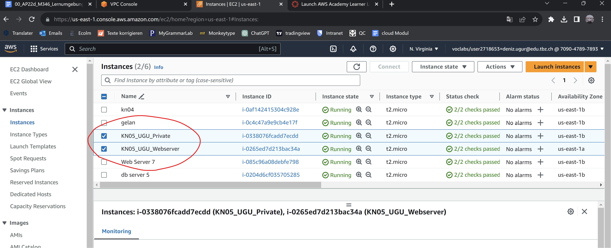
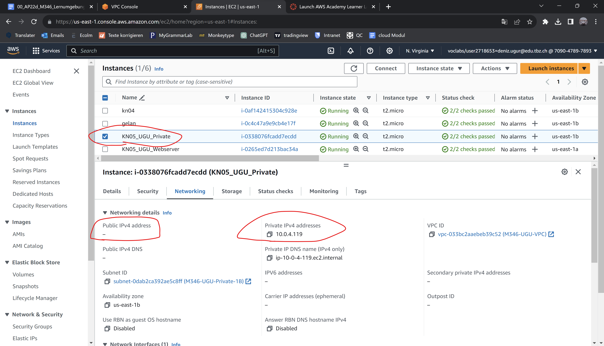
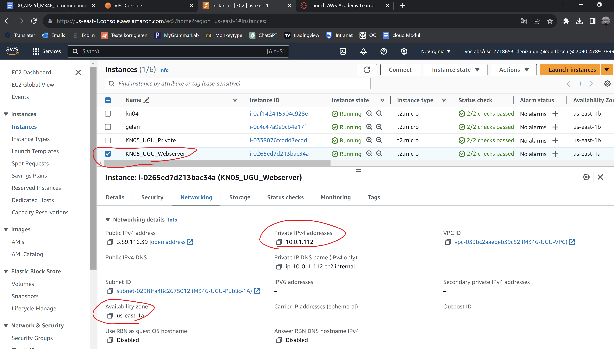
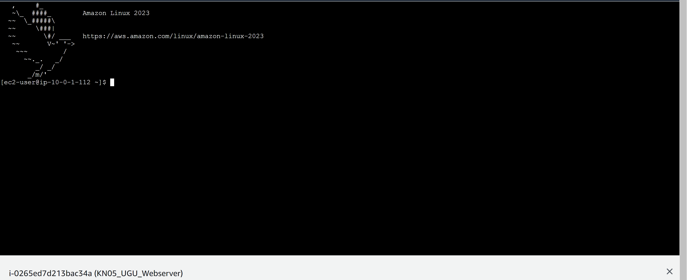
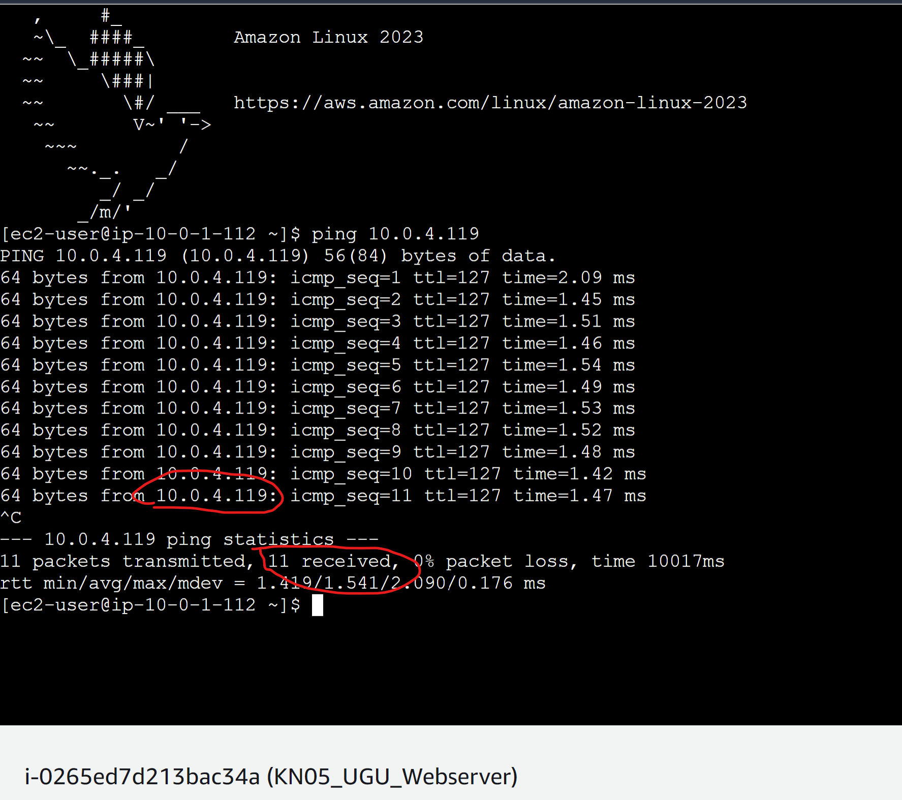

### Installation von zwei EC2-Instanzen mit unterschiedlichen Security Groups

#### Hier sind beide Instanzen die ich erstellt habe

#### Private Instanz

#### Webserver

#### Die Verbindung mit dem Webserver funktioniert

#### Ich habe mich nun über Instance connect verbunden

#### Ich konnte meine Private Instanz pingen🤯

//todo
Erklären Sie in eigenen Worten, wie Sie die zweite Security Group (M346-XXX-Priv-Only) ergänzt haben und wer welchen Zugriff auf die darin liegenden Instanzen hat.

 Wie sieht es aus bzgl. Redundanz / Hochverfügbarkeit? Geben Sie dazu eine technisch sinnvolle Analyse ab (inkl. Massnahmen); ohne dass der Coach Sie darauf aufmerksam macht. Hier wird geschaut, wie ausgeprägt Sie sich auf das Fachgespräch vorbereiten und ob Sie die Inhalte des Auftrages ganzheitlich durchlesen und erfüllen.