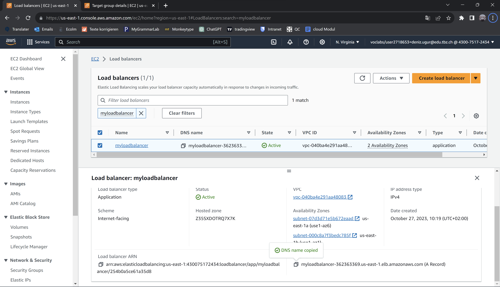

EC2 instanz gelaunched

Ich konnte via HTTP darauf zugreifen

Zweite EC2 instanz gelaunched

Ich konnte via HTTP darauf zugreifen

Hier ist der Load balancer den ich erstell habe

Hier sieht man, dass ich auf die public DNS vom loadbalancer zugreife und ich auf die EC2 Instanz geleitet werde

Hier kann man sehen, dass ich auf die gleiche domain zugreife, aber auf eine andere EC2 Instanz geleitet werde.

### Quelle
- [Gitlab](https://gitlab.com/ser-cal/m346/-/blob/main/KN05/KN05.md)