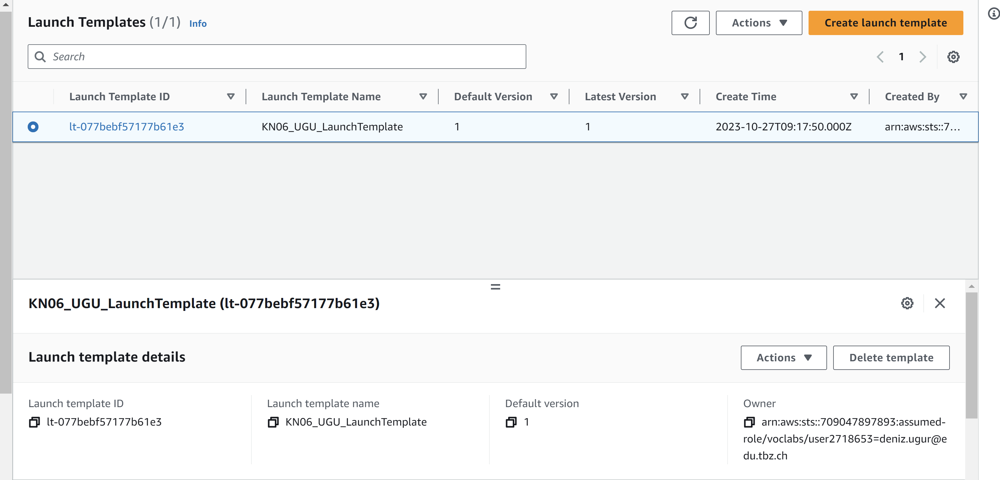
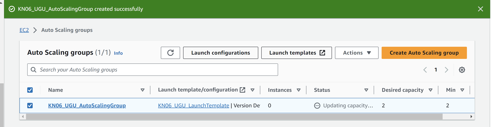
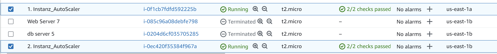
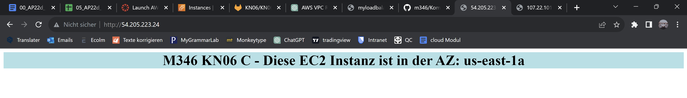
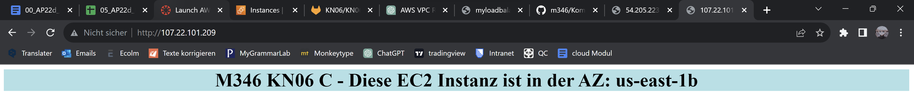

## Auto Scaling Group erstellen und anwenden

#### Das hier ist mein launch template, welche ich gemäss der Namenskonvention erstellt habe

#### Das hier ist mein auto scaling group, welche ich gemäss der Namenskonvention erstellt habe

#### Hier sind die Instanzen die von dem AutoScaler erstellt wurden

#### Ich konnte mich Via HTTP mit der Instanz verbinden

