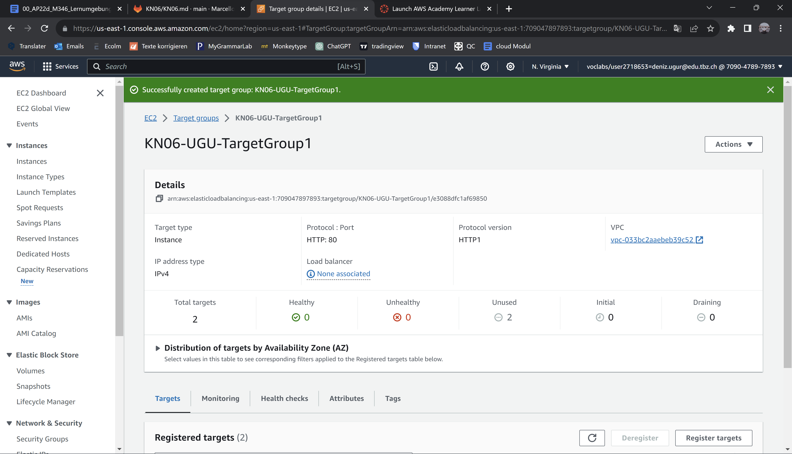
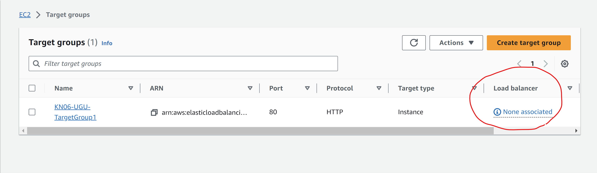
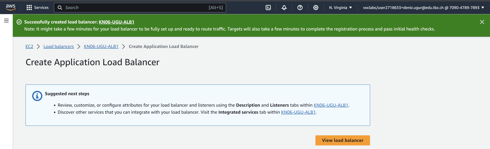
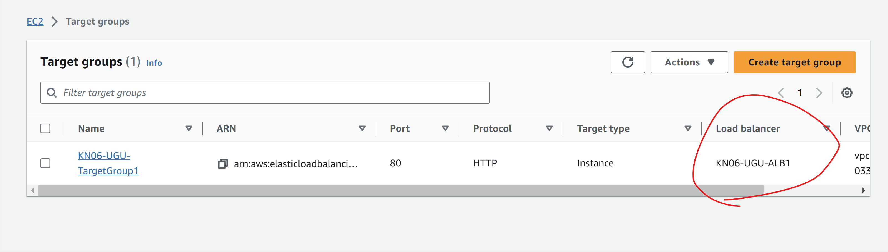
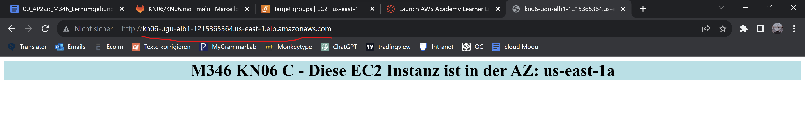
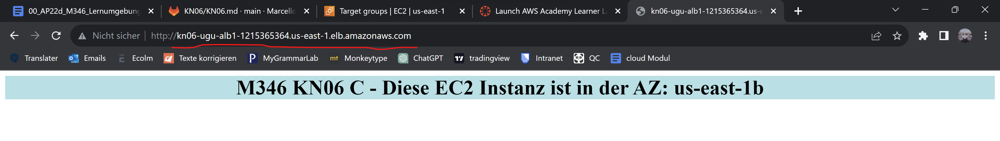

target group

noch kein Load Balancer in der target group vorhanden, wird sich aber bald ändern

Load Balancer erstellt 

targetgroup mit dem Load Balancer verbunden

Hier ist das Ergebnis 🤯
Der Load Balancer greift auf beide beide Availability Zones zu.

