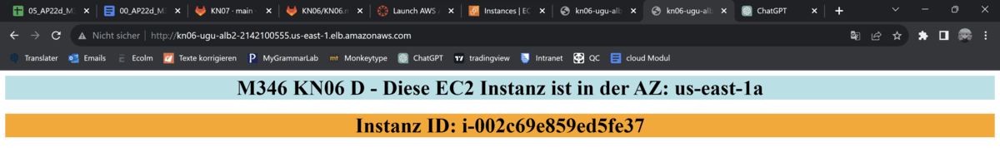

#### 1. instanz

#### 2. Instanz

#### Hier ist die Target Group die ich erstellt habe, hier sieht man, dass noch kein load balancer zugewiesen wurde

#### Meine Auto Scaling group

#### Mein Load Balancer wurde erstellt

#### Hier sieht man, dass meine Target Group meinen Load Balancer zugewiesen wurde

#### Bei jedem reaload greift der Load Balancer auf eine andere Instanz zu

### Ich habe mit einem Autoclicker etwa 1000 mal die Seite gereloaded und das ist das Ergebnis:

#### Alarm wurde erstellt und neue Instanzen wurden hochgefahren

### Quelle
- [Gitlab](https://gitlab.com/ser-cal/m346/-/blob/main/KN06/KN06.md)